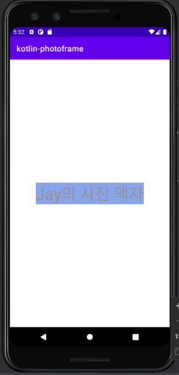

README.md 파일을 자신의 프로젝트에 대한 설명으로 변경한다. 단계별로 미션을 해결하고 리뷰를 받고나면 README.md 파일에 주요 작업 내용(바뀐 화면 이미지, 핵심 기능
설명)과 완성 날짜시간을 기록한다. 실행한 화면을 캡처해서 README.md 파일에 포함한다.

# Step 1

## 프로젝트 실행하기

- [x] Logcat 활용하기
  

## TextView 구현하기

- [x] TextView 추가하기
- [x] Design Editor 기능 활용해보기
- [x] MainActivity에서 TextView에 대한 참조를 얻어 text를 변경한다.
    - [x] findViewById 활용하기
    - [x] onCreate 함수에서 text 변경하기
    - [x] TextView 글자색 , 배경색 ,글자 크기 변경해보기

## Button 구현하기

## 다른 Activity 로 이동 하기

