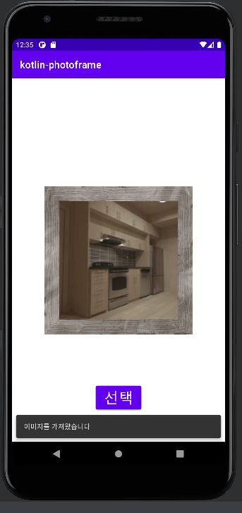
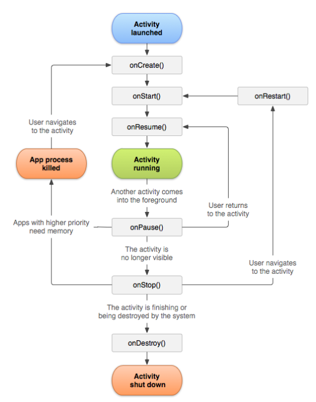
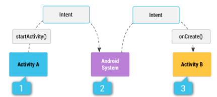

README.md 파일을 자신의 프로젝트에 대한 설명으로 변경한다. 단계별로 미션을 해결하고 리뷰를 받고나면 README.md 파일에 주요 작업 내용(바뀐 화면 이미지, 핵심 기능
설명)과 완성 날짜시간을 기록한다. 실행한 화면을 캡처해서 README.md 파일에 포함한다.

# Step2

<br></br>

## 코드로 ConstraintLayout에 View 배치하기

```
제시된 빈칸을 체운 부분은 아래와 같이 배치되어있습니다.
step 1. asset 폴더에서 파일 열기 
MyImage class 내부에서 실행

step 2. imageView에 표시
imageChange 함수에 구현
```
<br></br>


<br></br>

## 갤러리에서 사진 선택하기

1. Intent.ACTION_GET_CONTENT 형식의 Intent 를 뿌린다.
2. Intent 를 받고 이미지 주소를 돌려준다.
3. Glide 를 통해서 해당 주소에서 이미지를 가져온다.
   <br></br>


<br></br>

# 😃 추가 학습사항

## ✔Activity LifeCycle

### 0. 용어 설명
- 각 라이플 사이클 에서 라이프 사이클 함수들이 콜백된다.
- forground : Activity 가 화면에 보이고있는 경우
- background : Activity가 화면에 보이지 않은 경우
- foucus : 사용자가 Activity 에서   event 를 발생시킬 수  있는 상태

### 1. LifeCycle Callback Method

#### onCreate() 
- 엑티비티를 생성할때 실행
- 한번만 동작되는 초기화 및 시작 로직을 실행
- 화면을 접근할 때마다 **변화를 주지 않아도 되는 로직**

#### onStart() : STARTED 상태에서 호출
- 엑티비티가 사용자에 보여짐
- 사용자와의 상호작용을 준비

#### onResume() : RESUMED 상태에서 호출
- 사용자와 상호작용 가능 상태 (사용자의 포커스를 받은 상태)
- 액티비티가 보여지는 동안만 실행해야하는 모든 기능 활성화

```
// 카메라를 "RESUME" 상태에서 초기화한다.
// 카메라는 객체는 PAUSED 상태에서 해제 되기 때문이다.
// 이와 같이 상황에 맞게 함수를 호출 할 필요가 있다.
 
class CameraComponent : LifecycleObserver {
   ...
    @OnLifecycleEvent(Lifecycle.Event.ON_RESUME)
    fun initializeCamera() {
        if (camera == null) {
            getCamera()
        }
    }

    @OnLifecycleEvent(Lifecycle.Event.ON_PAUSE)
    fun releaseCamera() {
        camera?.release()
        camera = null
    }
    ...
}
```

#### onPaused()
- 사용자가 잠시 Activity 를 떠난 상태 
- 아주 잠깐 실행되기때문에 저장작업 , 네트워크 호출등의 작업은 지양

#### onStop()
- 필요지 않는 리소스를 해제하거나 조정
- 애니메이션을 일시중지
    - 멀티윈도우 상황에서 포커스를 잃는 경우 onPaused() 호출
    - 따라서 멀티윈도우를 고려하여 onStop 로직 배치
- 데이터 저장(DB)

#### onDestroy()
- 액티비티 완전 소멸
- finish() 호출 , 사용자의 앱종료 등
- 메모리 해제
- 기기회전 -> 바로 onCreate() 로 이어져서 새로운 화면 생성

### A 에서 B 로의 화면 이동
B가 완전히 시작 되기전에 A 화면은 stop 되지 않는다.
```
A onPause()
B onCreate()
B onStart()
B onResume()
A onStop()
```

### LifecycleOwner , LifecycleObserver
- LifecycleOwner : Activity 객체를 말하며 Lifecycle 객체를 가지고 있습니다.
- LifecycleObserver : LifeCycle 로부터 액티비티 상태 변화대 한 이벤트를 받습니다.





<br></br>

## ✔Intent

- 4대 컴포넌트들끼리 정보를 전달할 수 있게 해주는 매세징 객체이다.
- 구성 요소로 Action 과 Data 등이 있다.
- 두종류의 명시적 , 암시적 인텐트로 나뉜다.

### 1. 명시적 & 암시적 인텐트

#### 명시적 인텐트

- 클래스 객체나 컴포넌트 이름을 지정해서 호출할 대상을 아는 경우
- 앱 내부에서 사용함

#### 암시적 인텐트

- 액션과 데이터를 지정했지만 호출 대상이 달라질 수 있는 경우
- 앱 외부 통신할 때 사용함
- 설치된 앱 정보를 알고있는 안드로이드 OS가 인텐트에 맞는 적절한 앱의 컴포넌트를 찾고 사용자에게 대상과 처리 결과를 반환

### 2.인텐트 필터

- 매니패스트 파일에 존재함
- 확성기로 뿌려진 인텐트를 잡아낼 필터
    - 다른 앱의 특정 인텐트에 대해 응답 하고 싶다면 인텐트 필터에 명시해준다. .



### 3. 인텐트 구성요소

#### Action

- 인텐트를 대표하는 값
- 1개의 액션만을 가질 수 있음
- 인텐트의 Action 을 최우선적으로 고려하여 앱들의 인텐트 필터 내용 중 가장 적합한 컴포넌트 들을 채택함

```
public static final String ACTION_VIEW = "android.intent.action.VIEW";
public static final String ACTION_CALL = "android.intent.action.CALL";
```

#### Category

- 리졸빙 두번째 고려 속성
- Action 과 다르게 여러개 가능

#### Data

- URI 를 말한다.
- intent.setData(uri) 추가
- intent.data 로 접근

#### MIME Type

- 데이터 타입을 표시
- intent.setType("video/mp4")

### 리졸빙

- 인텐트 필터를 기준으로 인텐트에 맞는 컴포넌트를 찾는 과정
- intent를 보내는 앱의 PackageManager 는 디바이스 모든앱의 인텐트 필터를 검사해서 유사도를 파악하여 수치화한다.
<br></br>

## ✔프록시 패턴

프록시는 "대신" 이라는 의미로 프록시 패턴은 어떤 리소스를 직접 접근하지 않고 중간에 프록시 객체가 대신 응답해주는 방식을 말한다 이를 통해 리소스의 실질적 정보를 필요로하는
순간까지 로딩을 미룰 수 있다.

프록시 패턴을 통해 지연 로딩 후 캐시로 로딩한 파일을 가지고 있을 수 있다.

- (장점)즉시 로딩보다 메모리 사용량이 적음
- 비교적 최신 데이터를 로딩할 수 없음
- 실행시 병목점을 찾거나 클라이언트가 로딩 시점을 알 수없음
  <br></br>

## ✔옵저버 패턴 및 리스너

수신자 객체에서 발신자 객체로부터 event를 수신받기 위해서는 둘사이를 이어주는 Interface 를 이용할 수 있다.
### 1.구성

#### 둘사이를 이어줄 인터페이스(이하 리스너)

```
interface EventListener {
    fun onEvent(count: Int)
}
```

#### 발신자 객체

    - 발신자는 인자로서 리스너를 받는다.
    - 특정 이벤트 발생시 리스너의 함수를 실행한다.

#### 수신자 객체

- 리스너를 상속받아 리스너의 함수를 구현한다.

```

class EventPrinter : EventListener {
    override fun onEvent(count: Int) {
        print("${count}-")
    }
}
```

### 2. 동작 원리

- 발신자 객체에서 이벤트가 발생하면 생성시 인자로 넣은 인터페이스 함수를 실행한다.
- 컴파일시 연결된 인터페이스 함수의 구현체로 이동하여(수신자) 원하는 동작을 실행하다.  
  <br></br>

## ✔ViewBinding

- findViewById 를 대체하여 사용할 수 있음
- viewBinding은 gradle에 설정을통해 개발자가 작성한 레이아웃 파일들을 공식에 맞게 모두 바인딩클래스로 자동변환 해줍니다.
- 자동변환공식 : 레이아웃파일명(첫 글자와 언더바 다음영문을 대문자로 변환) + Binding
- ex) activity_main.xml = ActivityMainBinding
  <br></br>

## ✔Glide 라이브러리

- 이미지 주소를 통해서 간단히 이미지 로딩을 할 수 있다.
- 이미지 처리에 대한 다양한 함수를 제공하낟.
- 캐시 기능을 가지고 있어서 이미지를 빠르게 처리할 수 있다.