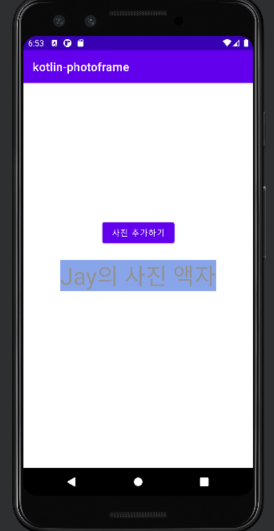
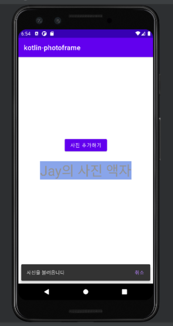

README.md 파일을 자신의 프로젝트에 대한 설명으로 변경한다. 단계별로 미션을 해결하고 리뷰를 받고나면 README.md 파일에 주요 작업 내용(바뀐 화면 이미지, 핵심 기능
설명)과 완성 날짜시간을 기록한다. 실행한 화면을 캡처해서 README.md 파일에 포함한다.

# Step 1

  

## 프로젝트 실행하기

- [x] Logcat 활용하기
  

  

## TextView 구현하기

- [x] TextView 추가하기
- [x] Design Editor 기능 활용해보기
- [x] MainActivity에서 TextView에 대한 참조를 얻어 text를 변경한다.
    - [x] findViewById 활용하기
    - [x] onCreate 함수에서 text 변경하기
    - [x] TextView 글자색 , 배경색 ,글자 크기 변경해보기

  

## Button 구현하기

- [x] activity_main.xml에 Button을 추가한다.

- [x] MainActivity에서 Button에 대한 참조를 얻는다.
- [x] Button을 클릭하면 '사진을 불러옵니다' 메시지를 띄운다.
    - [x] Button 클릭 이벤트에 대한 알림을 받아 처리한다.
    - [x] Snackbar 를 활용한다.

  

## 다른 Activity 로 이동 하기

- [x] 새로운 화면을 추가하고, '다음' 버튼 클릭 시, 이전 화면에서 이동시킨다.
- [x] 새로운 화면에서 '닫기' 버튼 클릭 시, 다시 이전 화면으로 되돌아갈 수 있다.

- [x] MainActivity에서 이동할 두번째 Activity를 추가한다
- [x] Activity Lifecycle의 모든 callback에 로그를 출력한다.
- [x] MainActivity의 버튼 텍스트를 '다음'으로 변경하고, 클릭하면 두번째 Activity로 이동시킨다.
- [x] 두번째 Activity에 '닫기' 버튼을 추가하고, 클릭 시 다시 MainActivity로 이동시킨다.
    - [x] 이 때, MainActivity에 '사진을 불러왔습니다'라는 메시지를 띄운다.

### startActivityForResult 함수의 deprecated

1. deprecated 이유   
   startActivityForResult 에 의해 로직이 수행되는 와중에 응답을 받을 Activity가 메모리 부족으로 인해 사라지는 경우가 존재한다는 것입니다. 이미지를
   가져오는 상황에서 큰 메모리를 처리하면서 이런 현상을 마주할 수 있었습니다. 따라서, 새로운 Activity Result API는 다른 Activity를 실행하는 코드
   위치에서 결과 콜백을 분리합니다. 결과 콜백은 프로세스와 Activity 을 다시 생성할 때 사용할 수 있어야 하므로 다른 Activity를 실행하는 로직이 사용자 입력 또는
   기타 비즈니스 로직을 기반으로만 발생하더라도 Activity가 생성될 때마다 콜백을 무조건 등록해야 합니다.

2. Activity Result API 소개  
   registerForActivityResult 함수는 콜백을 등록해주는 역할을 수행합니다. 이를 통해서 메모리 부족으로 시작점의 Activity 가 꺼진다고 하더라도 다시
   생성되었을때 결과를 기다리고 있다는 것을 알려줄 수 있습니다.

  

## 추가 구현 사항
- [ ] theme 과 style 을 이용한 다크모드 구현
- 