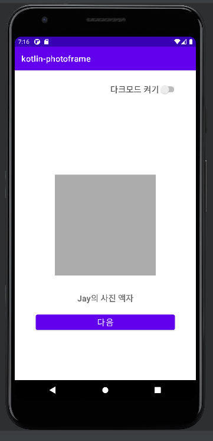
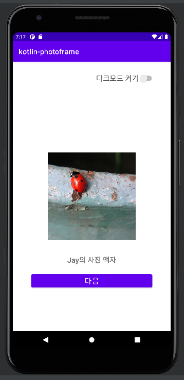

README.md 파일을 자신의 프로젝트에 대한 설명으로 변경한다. 단계별로 미션을 해결하고 리뷰를 받고나면 README.md 파일에 주요 작업 내용(바뀐 화면 이미지, 핵심 기능
설명)과 완성 날짜시간을 기록한다. 실행한 화면을 캡처해서 README.md 파일에 포함한다.

# Step 1

<br></br>

## 프로젝트 실행하기

- [x] Logcat 활용하기
  

<br></br>

## TextView 구현하기

- [x] TextView 추가하기
- [x] Design Editor 기능 활용해보기
- [x] MainActivity에서 TextView에 대한 참조를 얻어 text를 변경한다.
    - [x] findViewById 활용하기
    - [x] onCreate 함수에서 text 변경하기
    - [x] TextView 글자색 , 배경색 ,글자 크기 변경해보기


<br></br>

## Button 구현하기

- [x] activity_main.xml에 Button을 추가한다.

- [x] MainActivity에서 Button에 대한 참조를 얻는다.
- [x] Button을 클릭하면 '사진을 불러옵니다' 메시지를 띄운다.
    - [x] Button 클릭 이벤트에 대한 알림을 받아 처리한다.
    - [x] Snackbar 를 활용한다.


<br></br>

## 다른 Activity 로 이동 하기

- [x] 새로운 화면을 추가하고, '다음' 버튼 클릭 시, 이전 화면에서 이동시킨다.
- [x] 새로운 화면에서 '닫기' 버튼 클릭 시, 다시 이전 화면으로 되돌아갈 수 있다.


- [x] MainActivity에서 이동할 두번째 Activity를 추가한다
- [x] Activity Lifecycle의 모든 callback에 로그를 출력한다.
- [x] MainActivity의 버튼 텍스트를 '다음'으로 변경하고, 클릭하면 두번째 Activity로 이동시킨다.
- [x] 두번째 Activity에 '닫기' 버튼을 추가하고, 클릭 시 다시 MainActivity로 이동시킨다.
    - [x] 이 때, MainActivity에 '사진을 불러왔습니다'라는 메시지를 띄운다.

### startActivityForResult 함수의 deprecated

1. deprecated 이유   
   startActivityForResult 에 의해 로직이 수행되는 와중에 응답을 받을 Activity가 메모리 부족으로 인해 사라지는 경우가 존재한다는 것입니다. 이미지를
   가져오는 상황에서 큰 메모리를 처리하면서 이런 현상을 마주할 수 있었습니다. 따라서, 새로운 Activity Result API는 다른 Activity를 실행하는 코드
   위치에서 결과 콜백을 분리합니다. 결과 콜백은 프로세스와 Activity 을 다시 생성할 때 사용할 수 있어야 하므로 다른 Activity를 실행하는 로직이 사용자 입력 또는
   기타 비즈니스 로직을 기반으로만 발생하더라도 Activity가 생성될 때마다 콜백을 무조건 등록해야 합니다.

2. Activity Result API 소개  
   registerForActivityResult 함수는 콜백을 등록해주는 역할을 수행합니다. 이를 통해서 메모리 부족으로 시작점의 Activity 가 꺼진다고 하더라도 다시
   생성되었을때 결과를 기다리고 있다는 것을 알려줄 수 있습니다.

<br></br>

## 추가 구현 사항

- [x] theme 과 style 을 이용한 다크모드 구현

# Step2

<br></br>

## 코드로 ConstraintLayout에 View 배치하기

- [x] 실행하고 새로운 화면을 캡처해서 README.md 파일에 포함한다.
- [X] MainActivity에 ImageView를 240 x 240 크기로 배치한다.
- [X] ImageView에 보여줄 이미지 리소스를 다운로드 한다. 압축을 풀고, 파일들을 assets 폴더 하위에 추가한다.
- [X] assets 폴더의 이미지 파일 01.jpg를 열어 Bitmap으로 변환해 ImageView에 표시한다.
    - [X] 생략한 부분의 구현을 완료해주세요.
- [x] '다음' 버튼 클릭 시, 다운로드 받은 이미지 01~22까지 랜덤으로 숫자를 선택해서 ImageView에 표시한다.
    - [x] 앱이 처음 실행되었을 때는 ImageView의 배경색만 보인다.
    - [x] 이전 단계에서 구현했던 화면 이동 기능은 제거한다.
    - [x] 랜덤으로 숫자를 생성하고, fileName을 포맷에 맞게 변경한다.
- [X] ImageView의 scaleType 속성을 활용해 이미지를 표시하는 방법을 결정한다.
- [x] ImageView ~ Button까지 제약조건을 추가해
- [x] ConstraintLayout의 중앙에 정렬한다.

```
제시된 빈칸을 체운 부분은 아래와 같이 배치되어있습니다.
step 1. asset 폴더에서 파일 열기 
MyImage class 내부에서 실행

step 2. imageView에 표시
imageChange 함수에 구현
```




<br></br>

## 갤러리에서 사진 선택하기


<br></br>

<br></br>

# 추가 학습사항

## Activity 생명주기

## 프록시 패턴

프록시는 "대신" 이라는 의미로 프록시 패턴은 어떤 리소스를 직접 접근하지 않고 중간에 프록시 객체가 대신 응답해주는 방식을 말한다 이를 통해 리소스의 실질적 정보를 필요로하는
순간까지 로딩을 미룰 수 있다.

프록시 패턴을 통해 지연 로딩 후 캐시로 로딩한 파일을 가지고 있을 수 있다.

- (장)즉시 로딩보다 메모리 사용량이 적긴
- 비교적 최신 데이터를 로딩할 수 없음
- 실행시 병목점을 찾거나 클라이언트가 로딩 시점을 알 수없음

## 옵저버 패턴 및 리스너

수신자 객체에서 발신자 객체로부터 event를 수신받기 위해서는 둘사이를 이어주는 Interface 를 이용할 수 있다.

### 1. 둘사이를 이어줄 인터페이스(이하 리스너)

```
interface EventListener {
    fun onEvent(count: Int)
}
```

### 2. 발신자 객체

    - 발신자는 인자로서 리스너를 받는다.
    - 특정 이벤트 발생시 리스너의 함수를 실행한다.

### 3. 수신자 객체

- 리스너를 상속받아 리스너의 함수를 구현한다.

```

class EventPrinter : EventListener {
    override fun onEvent(count: Int) {
        print("${count}-")
    }
}
```

### 동작 원리

- 발신자 객체에서 이벤트가 발생하면 생성시 인자로 넣은 인터페이스 함수를 실행한다.
- 컴파일시 연결된 인터페이스 함수의 구현체로 이동하여(수신자) 원하는 동작을 실행하다.  

## ViewBinding
- findViewById 를 대체하여 사용할 수 있음
- viewBinding은 gradle에 설정을통해 개발자가 작성한 레이아웃 파일들을 공식에 맞게 모두 바인딩클래스로 자동변환 해줍니다.
- 자동변환공식 : 레이아웃파일명(첫 글자와 언더바 다음영문을 대문자로 변환) + Binding
- ex) activity_main.xml = ActivityMainBinding
